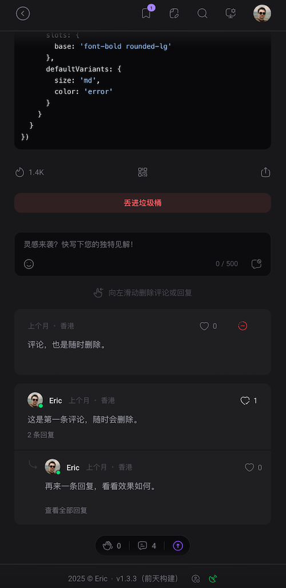
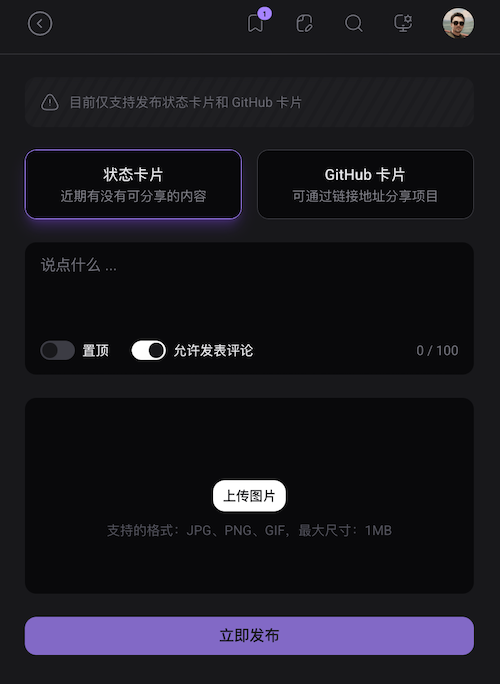

## ericdit.com Nuxt 4 重构版 / Nuxt 4 Refactor for ericdit.com


这是基于 [Nuxt 4](https://nuxt.com/) 的个人网站重构项目，支持内容收藏、评论、点赞、用户在线或离线状态、更新提示、实时订阅等功能。  
This is a personal website refactor project based on [Nuxt 4](https://nuxt.com/), featuring content bookmarks, comments, likes, user online/offline status, notifications, realtime, and more.






---

### 📦 数据库结构 / Database Schema

请参考 [`app/types/index.ts`](app/types/index.ts) 查看数据库结构定义。  
For database schema, please refer to [`app/types/index.ts`](app/types/index.ts).

---

### ⚙️ 环境变量 / Environment Variables

请根据 `env.example` 文件配置你的环境变量（如 Directus API 地址、站点 URL 等）。  
Please configure your environment variables according to `env.example` (such as Directus API URL, site URL, etc).

---

### 🚀 安装与启动 / Setup & Start

#### 安装依赖 / Install dependencies

```bash
npm install
```

### 启动开发服务器 / Start the development server

```bash
npm run dev
```

#### 构建并启动生产服务器 / Build and start the production server

```bash
npm run build
pm2 start ecosystem.config.js
```

#### 如果变更版本号和 Hash 值，需要执行以下命令：
#### If you changed version number and hash value, you need to run the following command:
```bash
npm run bump && npm run build
```

---

### 📝 贡献 / Contributing

欢迎提出问题、提出建议、参与代码贡献等。
Welcome to report issues, suggest improvements, and contribute code.

<style>
  img {
    max-width: 300px;
    height: auto;
    border-radius: 10px;
  }
</style>